Coronary Heart Disease Prediction
================

``` r
library(ggplot2)
library(dplyr) 
```

    ## 
    ## Attaching package: 'dplyr'

    ## The following objects are masked from 'package:stats':
    ## 
    ##     filter, lag

    ## The following objects are masked from 'package:base':
    ## 
    ##     intersect, setdiff, setequal, union

``` r
library(Amelia)
```

    ## Loading required package: Rcpp

    ## ## 
    ## ## Amelia II: Multiple Imputation
    ## ## (Version 1.8.1, built: 2022-11-18)
    ## ## Copyright (C) 2005-2022 James Honaker, Gary King and Matthew Blackwell
    ## ## Refer to http://gking.harvard.edu/amelia/ for more information
    ## ##

``` r
library(corrplot)
```

    ## corrplot 0.92 loaded

``` r
library(psych)
```

    ## 
    ## Attaching package: 'psych'

    ## The following objects are masked from 'package:ggplot2':
    ## 
    ##     %+%, alpha

``` r
library(caret)
```

    ## Loading required package: lattice

``` r
library(cvms)
library(ROSE)
```

    ## Loaded ROSE 0.0-4

``` r
library(smotefamily)
library(class)
library(randomForest)
```

    ## randomForest 4.7-1.1

    ## Type rfNews() to see new features/changes/bug fixes.

    ## 
    ## Attaching package: 'randomForest'

    ## The following object is masked from 'package:psych':
    ## 
    ##     outlier

    ## The following object is masked from 'package:dplyr':
    ## 
    ##     combine

    ## The following object is masked from 'package:ggplot2':
    ## 
    ##     margin

``` r
library(gridExtra)
```

    ## 
    ## Attaching package: 'gridExtra'

    ## The following object is masked from 'package:randomForest':
    ## 
    ##     combine

    ## The following object is masked from 'package:dplyr':
    ## 
    ##     combine

``` r
heart_data <- read.csv("/Users/saisharanburugu/Desktop/STAT 515/Final Project/framingham.csv")
```

``` r
missmap(heart_data)
```

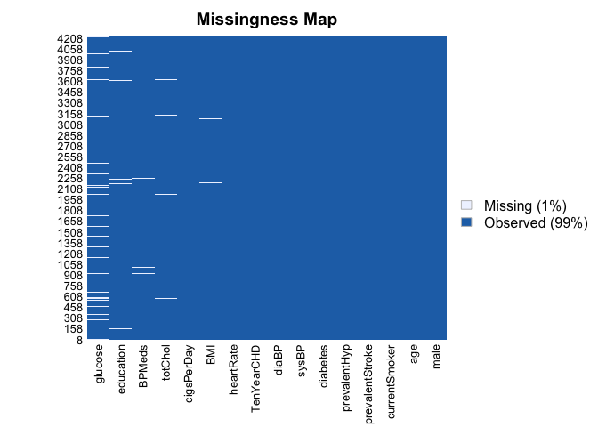<!-- -->

Check Null Values in the dataset and impute

``` r
sum(is.na(heart_data))
```

    ## [1] 645

Checking for null values in Age Columns

``` r
sum(which(is.na(heart_data$age)))
```

    ## [1] 0

Finding null values in Education Column and replacing the null values
with the median of it.

``` r
length(which(is.na(heart_data$education)))
```

    ## [1] 105

``` r
heart_data$education[is.na(heart_data$education)] <- median(heart_data$education, na.rm = T)
```

Finding null values in Current Smoker

``` r
length(which(is.na(heart_data$currentSmoker)))
```

    ## [1] 0

Finding null values in Cigarettes Column and replacing the null values
with the median of it.

``` r
length(which(is.na(heart_data$cigsPerDay)))
```

    ## [1] 29

``` r
heart_data$cigsPerDay[is.na(heart_data$cigsPerDay)] <- median(heart_data$cigsPerDay, na.rm = T)
```

Finding null values in BPMeds Column and replacing the null values with
the median of it.

``` r
length(which(is.na(heart_data$BPMeds)))
```

    ## [1] 53

``` r
heart_data$BPMeds[is.na(heart_data$BPMeds)] <- median(heart_data$BPMeds, na.rm = T)
```

Finding null values in prevalentStroke Column

``` r
length(which(is.na(heart_data$prevalentStroke)))
```

    ## [1] 0

Finding null values in prevalentHyp Column

``` r
length(which(is.na(heart_data$prevalentHyp)))
```

    ## [1] 0

Finding null values in totChol Column and replacing the null values with
the median of it

``` r
length(which(is.na(heart_data$totChol)))
```

    ## [1] 50

``` r
heart_data$totChol[is.na(heart_data$totChol)] <- median(heart_data$totChol, na.rm = T)
```

Finding null values in BMI Column and replacing the null values with the
median of it

``` r
length(which(is.na(heart_data$BMI)))
```

    ## [1] 19

``` r
heart_data$BMI[is.na(heart_data$BMI)] <- median(heart_data$BMI, na.rm = T)
```

Finding null values in heartRate Column and replacing the null values
with the median of it

``` r
length(which(is.na(heart_data$heartRate)))
```

    ## [1] 1

``` r
heart_data$heartRate[is.na(heart_data$heartRate)] <- median(heart_data$heartRate, na.rm = T)
```

Finding null values in glucose Column and replacing the null values with
the median of it

``` r
length(which(is.na(heart_data$glucose)))
```

    ## [1] 388

``` r
heart_data$glucose[is.na(heart_data$glucose)] <- median(heart_data$glucose, na.rm = T)
```

Subset of Continuous Variables to find the correlation between the
variables

``` r
cont_df = subset(heart_data, select=c("age", "cigsPerDay", 'totChol', 'sysBP',
                               'diaBP', 'BMI', 'heartRate', 'glucose'))
```

Removing the outliers in totChol column as they make no sense one cannot
have cholestrol more than 590

``` r
heart_data <- subset(heart_data, heart_data$totChol < 590)
```

Finding the Relationship between continuous variables

``` r
pairs.panels(cont_df, smooth = TRUE,
            cex.cor = 1, pch = 20, hist.col = 5,
            scale = FALSE, density = TRUE, ellipses = TRUE,
            method = 'pearson', ci=TRUE, stars=TRUE, lm=FALSE, cor = TRUE)
```

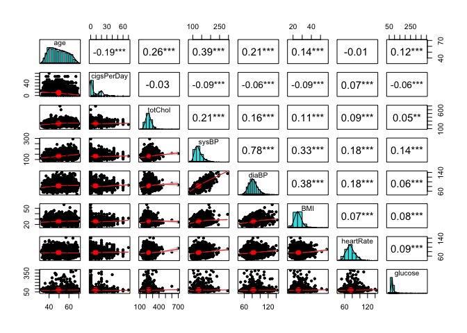<!-- -->

# Exploratory Data Analysis

``` r
ggplot(data = heart_data, mapping = aes(x = as.factor(TenYearCHD), y = age, fill = as.factor(TenYearCHD))) +
  geom_boxplot() +
  labs(x="10 Year Risk", y="Age", title="Distribution of Age with respect to 10 year Risk")+
  theme(plot.title = element_text(hjust = 0.5,size = 25,face="bold"),axis.title = element_text(,size = 20),
        axis.text =element_text(size=13) ) +
  scale_x_discrete(labels=c("0" = "No", "1" = "Yes")) +
  scale_fill_manual(values = c("green","red"))
```

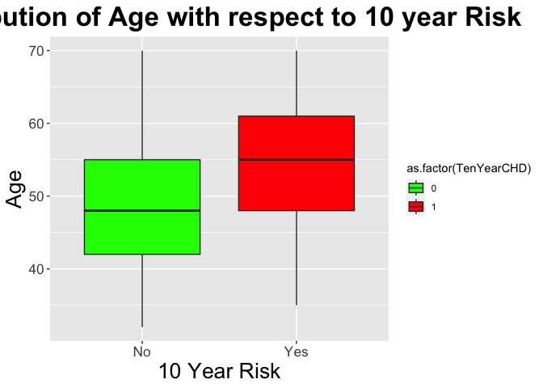<!-- -->
This box plot represents the relation between Age and 10-Year risk. Here
the Red box is for “Yes” and the green box is for “No”. The line in the
middle of box represents the median value. We can see that the median of
the ‘Yes’ values is higher than ‘No’ values. It represents that as the
age increases there is a higher risk of having CHD in coming 10 years.

``` r
ggplot(heart_data, aes(x=age)) +
  geom_histogram(bins = 30)
```

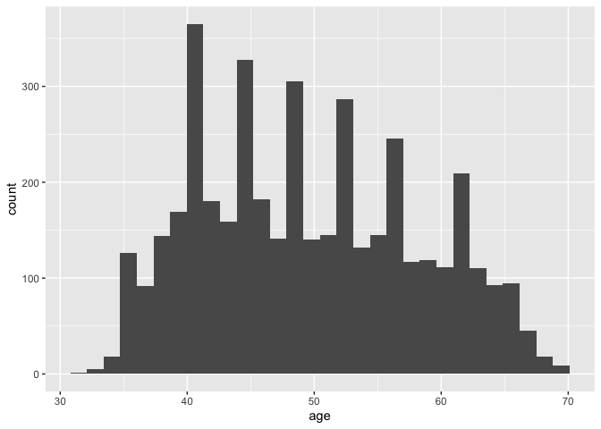<!-- -->

``` r
ggplot(data = heart_data, mapping = aes(x = as.factor(TenYearCHD), y = totChol, fill = as.factor(TenYearCHD))) +
  geom_boxplot() +
  labs(x="10 Year Risk", y='Total Cholesterol', title="Distribution of Total Cholesterol with respect to 10 year Risk")+
  theme(plot.title = element_text(hjust = 0.5), legend.position = "none") +
  scale_x_discrete(labels=c("0" = "No", "1" = "Yes")) +
  scale_fill_manual(values = c("green","red"))
```

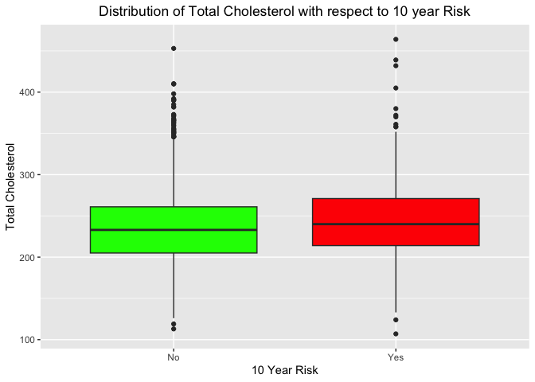<!-- -->
The following box plot represents the relationship between total
cholesterol and 10-year risk. From the box plot we can determine that
the median for the positive class is slightly higher than the negative
class. This represents that increase in total cholesterol will increase
the risk of Coronary Heart Disease over the next 10 years.

``` r
a = ggplot(data = heart_data, mapping = aes(x = as.factor(TenYearCHD), y = sysBP, fill = as.factor(TenYearCHD))) +
  geom_boxplot() +
  labs(x="10 Year Risk", y='Systolic Blood Pressure', title="Distribution of Systolic BP with respect to 10 year Risk")+
  theme(plot.title = element_text(hjust = 0.5), legend.position = "none") +
  scale_x_discrete(labels=c("0" = "No", "1" = "Yes"))+
  scale_fill_manual(values = c("green","red"))

b = ggplot(data = heart_data, mapping = aes(x = as.factor(TenYearCHD), y = diaBP, fill = as.factor(TenYearCHD))) +
  geom_boxplot() +
  labs(x="10 Year Risk", y='Diastolic Blood Pressure', title="Distribution of Diastolic BP with respect to 10 year Risk")+
  theme(plot.title = element_text(hjust = 0.5), legend.position = "none") +
  scale_x_discrete(labels=c("0" = "No", "1" = "Yes")) +
  scale_fill_manual(values = c("green","red"))

grid.arrange(a, b, ncol=2)
```

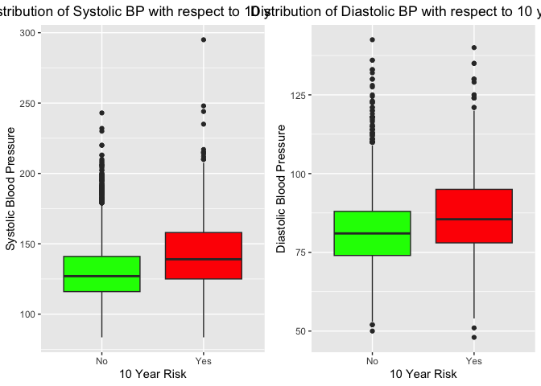<!-- -->
Blood pressure is measured using two features, the first one is systolic
blood pressure which measures the pressure when the heart beats and the
second one which is diastolic blood pressure measures the pressure when
heart rests between beats from the below box plots. Both Systolic BP and
Diastolic BP is higher for the positive class. We can determine that if
the Systolic BP and Diastolic BP increases the risk of CHD over the next
10 years also increases.

``` r
ggplot(heart_data, aes(x=BMI,  fill=as.factor(TenYearCHD))) +
  geom_histogram(bins = 30)+
  theme(plot.title = element_text(hjust = 0.5)) +
  labs(x='BMI', y='Frequency', title='Distribution of BMI')+
  theme(text = element_text(size = 16))+
   scale_fill_manual(values = c("green","red"))
```

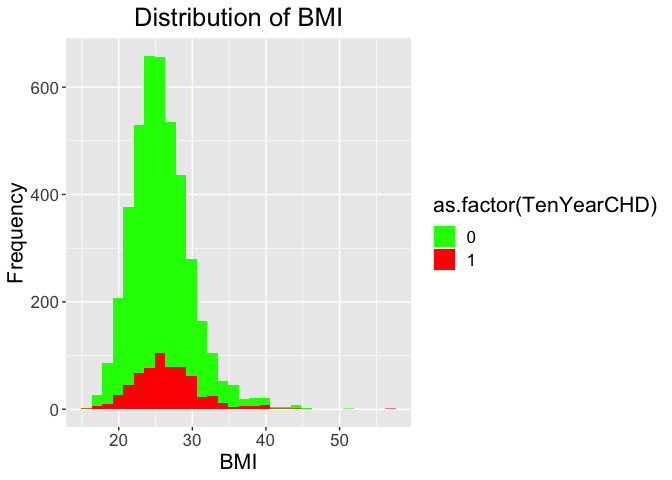<!-- -->

``` r
ggplot(data = heart_data, mapping = aes(x = as.factor(TenYearCHD), y = BMI, fill = as.factor(TenYearCHD))) +
  geom_boxplot() +
  labs(x="10 Year Risk", y='BMI', title="Distribution of BMI with respect to 10 year Risk")+
  theme(plot.title = element_text(hjust = 0.5), legend.position = "none") +
  scale_x_discrete(labels=c("0" = "No", "1" = "Yes")) +
    scale_fill_manual(values = c("green","red"))
```

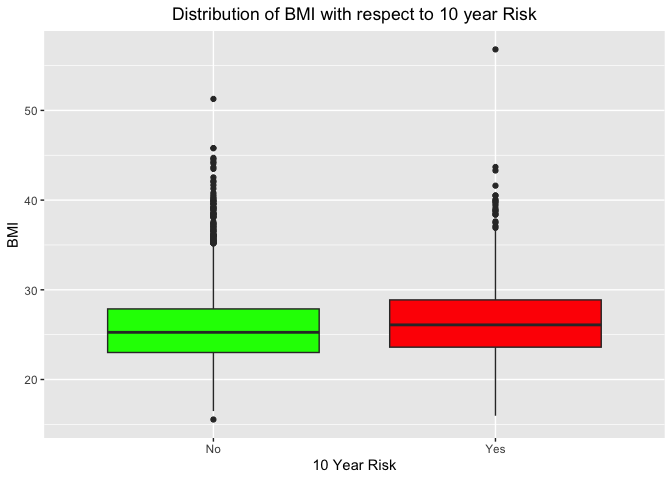<!-- -->

``` r
cigs_df <- heart_data %>% filter(TenYearCHD %in% c('0', '1')) %>% mutate(TenYearCHD=as.factor(TenYearCHD)) %>%
  group_by(cigsPerDay, TenYearCHD) %>% summarize(total=n())
```

    ## `summarise()` has grouped output by 'cigsPerDay'. You can override using the
    ## `.groups` argument.

``` r
ggplot(cigs_df, aes(x=cigsPerDay,y=total, fill=TenYearCHD),total)+
  geom_col(position="dodge")+
  labs(title="Ciga", x="Cigarettes per Day", y= "Total Count of People")+
  theme(plot.title = element_text(hjust = 0.5)) +
  geom_text(aes(label = total), 
            position = position_dodge(0.9),
            color="black",vjust = -0.5, size = 4) +
  theme(text = element_text(size = 16))
```

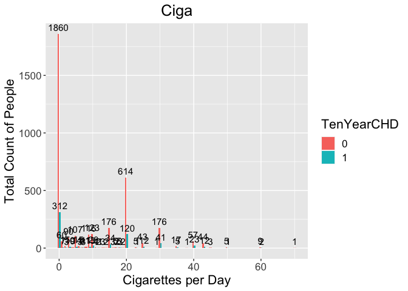<!-- -->

``` r
sum = aggregate(heart_data$cigsPerDay, list(heart_data$age), FUN=sum) 
ggplot(sum, aes(x=Group.1,y=x))+
  geom_col(position="dodge", fill='darkorchid1') +
  theme(plot.title = element_text(hjust = 0.5)) +
  labs(title="Cigarettes consumptions by Age", x="Age", y= "Frequency")
```

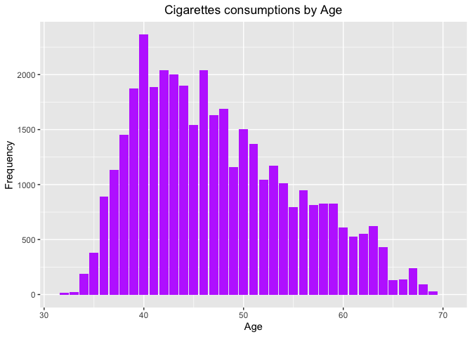<!-- -->

Removing Education Column because it is not relavant to the Analysis

``` r
heart_data = subset(heart_data, select = -c(education))
```

# Modeling

The problem we are trying to solve is – predicting whether a person is
at a risk of getting a heart disease in the next 10-year span. The
modeling algorithms we used are Logistic Regression, K- Nearest
Neighbors, Random Forest. For all the models, we used various metrics to
calculate the test results. Accuracy is the primary metric. However,
relying only on accuracy to validate the model is not ideal. So, we
considered Confusion Matrix to derive Precision, Recall and F1 – Score.
This is because we tried to reduce Type 1 (False Positives) and Type 2
errors (False Negatives)

Subsetting the dataset into two dataframe with train data of 80% and
test data of 20% and setting a seed of 100.

``` r
set.seed(100)
train.index <- createDataPartition(heart_data$TenYearCHD, p = .8, list = FALSE)
train_data <- heart_data[ train.index,]
test_data  <- heart_data[-train.index,]
```

# Logistic Regression

Logistic Regression is used when the class variable is binary, such
classification is called binary classification. Further, it can also be
used for Multi-Class Classification. It is used to explain the relation
between one dependent variable(Y) with one or more independent variables
(X).

Fitting the Logistic Regression Model on the training dataset

``` r
glm.fit <- glm(TenYearCHD~., 
               data=train_data,
               family=binomial)
summary(glm.fit)
```

    ## 
    ## Call:
    ## glm(formula = TenYearCHD ~ ., family = binomial, data = train_data)
    ## 
    ## Deviance Residuals: 
    ##     Min       1Q   Median       3Q      Max  
    ## -1.9793  -0.5884  -0.4261  -0.2955   2.7656  
    ## 
    ## Coefficients:
    ##                   Estimate Std. Error z value Pr(>|z|)    
    ## (Intercept)     -8.0018400  0.7254339 -11.030  < 2e-16 ***
    ## male             0.5489355  0.1124955   4.880 1.06e-06 ***
    ## age              0.0630389  0.0069174   9.113  < 2e-16 ***
    ## currentSmoker    0.1338442  0.1589377   0.842  0.39972    
    ## cigsPerDay       0.0154156  0.0063155   2.441  0.01465 *  
    ## BPMeds           0.2020857  0.2508419   0.806  0.42046    
    ## prevalentStroke  1.0836146  0.5000761   2.167  0.03024 *  
    ## prevalentHyp     0.3486093  0.1450982   2.403  0.01628 *  
    ## diabetes         0.3437868  0.3263998   1.053  0.29222    
    ## totChol          0.0010359  0.0012104   0.856  0.39211    
    ## sysBP            0.0126643  0.0039984   3.167  0.00154 ** 
    ## diaBP           -0.0079836  0.0066583  -1.199  0.23051    
    ## BMI              0.0201833  0.0130838   1.543  0.12292    
    ## heartRate        0.0006866  0.0043120   0.159  0.87349    
    ## glucose          0.0058295  0.0022963   2.539  0.01113 *  
    ## ---
    ## Signif. codes:  0 '***' 0.001 '**' 0.01 '*' 0.05 '.' 0.1 ' ' 1
    ## 
    ## (Dispersion parameter for binomial family taken to be 1)
    ## 
    ##     Null deviance: 2853.5  on 3388  degrees of freedom
    ## Residual deviance: 2539.6  on 3374  degrees of freedom
    ## AIC: 2569.6
    ## 
    ## Number of Fisher Scoring iterations: 5

Predicting the model values using the Logistic Regression Model and
converting the output to factor variable to plot the Confusion Matrix

``` r
test.predicted.model <- predict(glm.fit, test_data, type = "response")
glm.pred=rep(0,nrow(test_data))
glm.pred[test.predicted.model>.5]=1
glm.pred<- as.factor(glm.pred)
```

Constructing the Confusion Matrix from caret package

``` r
confusion_LR <-confusionMatrix(as.factor(test_data$TenYearCHD), glm.pred,positive="1")
confusion_LR
```

    ## Confusion Matrix and Statistics
    ## 
    ##           Reference
    ## Prediction   0   1
    ##          0 703   6
    ##          1 125  13
    ##                                          
    ##                Accuracy : 0.8453         
    ##                  95% CI : (0.8192, 0.869)
    ##     No Information Rate : 0.9776         
    ##     P-Value [Acc > NIR] : 1              
    ##                                          
    ##                   Kappa : 0.1314         
    ##                                          
    ##  Mcnemar's Test P-Value : <2e-16         
    ##                                          
    ##             Sensitivity : 0.68421        
    ##             Specificity : 0.84903        
    ##          Pos Pred Value : 0.09420        
    ##          Neg Pred Value : 0.99154        
    ##              Prevalence : 0.02243        
    ##          Detection Rate : 0.01535        
    ##    Detection Prevalence : 0.16293        
    ##       Balanced Accuracy : 0.76662        
    ##                                          
    ##        'Positive' Class : 1              
    ## 

Fetching All the metrics of Logistic Regression model

``` r
confusion_LR$byClass
```

    ##          Sensitivity          Specificity       Pos Pred Value 
    ##           0.68421053           0.84903382           0.09420290 
    ##       Neg Pred Value            Precision               Recall 
    ##           0.99153738           0.09420290           0.68421053 
    ##                   F1           Prevalence       Detection Rate 
    ##           0.16560510           0.02243211           0.01534829 
    ## Detection Prevalence    Balanced Accuracy 
    ##           0.16292798           0.76662217

Plotting the Confusion Matrix using cvms library

``` r
conf_mat_lr <- confusion_matrix(targets = as.factor(test_data$TenYearCHD),
                                predictions = as.factor(glm.pred)) 

plot_confusion_matrix(conf_mat_lr$`Confusion Matrix`[[1]],
                      font_counts = font(
                        size = 7,
                        color = "black"
                      ),palette = "Greens")
```

    ## Warning in plot_confusion_matrix(conf_mat_lr$`Confusion Matrix`[[1]],
    ## font_counts = font(size = 7, : 'ggimage' is missing. Will not plot arrows and
    ## zero-shading.

    ## Warning in plot_confusion_matrix(conf_mat_lr$`Confusion Matrix`[[1]],
    ## font_counts = font(size = 7, : 'rsvg' is missing. Will not plot arrows and zero-
    ## shading.

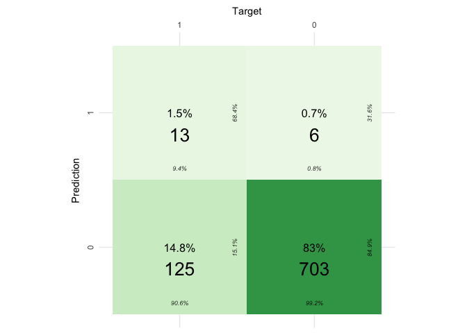<!-- -->
Due to class imbalance, False Negatives are higher which is a Type 2
error. It wrongly classifies a person with a risk of getting a heart
disease into NOT getting a heart disease. Such errors cost the people
lives. So, in the medical field, it is very important to reduce the
False Negatives.

# K- Nearest Neighbors

KNN is a lazy learning algorithm. First, data (of n features) is
projected into a n-dimensional space, for a test data point Xq it
calculates the distance from this point to all the data points in the
training dataset. Based on the value of the K, it gets class label of
the top K nearest data points and calculates the maximum votes among all
the nearest neighbors and assigns to the test point Xq.

Converting the dataframe into matrix by eliminating the output variable
to run KNN Algorithm

``` r
trainx <- as.matrix(train_data[,-15])
valx <- as.matrix(test_data[,-15])
```

Finding the best K-Value for KNN so that we can plot the confusion
matrix using that K- Value

``` r
set.seed(100)
error<-rep(NA,200)
for(i in 1:200)
{
  knn.pred=knn(trainx,valx,train_data$TenYearCHD,k=i)
  error[i]=mean(knn.pred!=test_data$TenYearCHD)
}
plot(error,type="l",xlab="K",ylab="Test Error",main = "K Value vs Test Error for KNN")
```

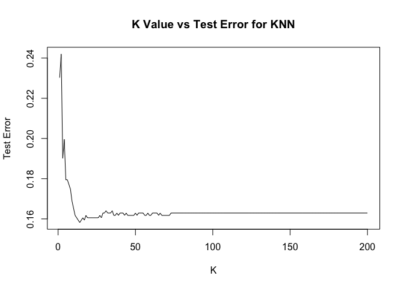<!-- -->

``` r
loc=which.min(error)
loc
```

    ## [1] 14

As we get the best k value as 14 we fit the model using k=14 and plot
the confusion matrix

``` r
knn.pred <- knn(trainx, valx, train_data$TenYearCHD, k=14, prob=TRUE)
cf_mat_knn <- confusionMatrix(data =  as.factor(knn.pred), reference = as.factor(test_data$TenYearCHD), positive="1")
cf_mat_knn
```

    ## Confusion Matrix and Statistics
    ## 
    ##           Reference
    ## Prediction   0   1
    ##          0 707 130
    ##          1   2   8
    ##                                           
    ##                Accuracy : 0.8442          
    ##                  95% CI : (0.8179, 0.8679)
    ##     No Information Rate : 0.8371          
    ##     P-Value [Acc > NIR] : 0.3071          
    ##                                           
    ##                   Kappa : 0.088           
    ##                                           
    ##  Mcnemar's Test P-Value : <2e-16          
    ##                                           
    ##             Sensitivity : 0.057971        
    ##             Specificity : 0.997179        
    ##          Pos Pred Value : 0.800000        
    ##          Neg Pred Value : 0.844683        
    ##              Prevalence : 0.162928        
    ##          Detection Rate : 0.009445        
    ##    Detection Prevalence : 0.011806        
    ##       Balanced Accuracy : 0.527575        
    ##                                           
    ##        'Positive' Class : 1               
    ## 

Fetching All the metrics of K-Nearest Neighbors model

``` r
cf_mat_knn$byClass
```

    ##          Sensitivity          Specificity       Pos Pred Value 
    ##           0.05797101           0.99717913           0.80000000 
    ##       Neg Pred Value            Precision               Recall 
    ##           0.84468339           0.80000000           0.05797101 
    ##                   F1           Prevalence       Detection Rate 
    ##           0.10810811           0.16292798           0.00944510 
    ## Detection Prevalence    Balanced Accuracy 
    ##           0.01180638           0.52757507

Plotting the Confusion Matrix using cvms library

``` r
conf_mat_knn <- confusion_matrix(targets = test_data$TenYearCHD,
                                 predictions = as.factor(knn.pred)) 


plot_confusion_matrix(conf_mat_knn$`Confusion Matrix`[[1]],
                      font_counts = font(
                        size = 7,
                        color = "black"
                      ),palette = "Greens")
```

    ## Warning in plot_confusion_matrix(conf_mat_knn$`Confusion Matrix`[[1]],
    ## font_counts = font(size = 7, : 'ggimage' is missing. Will not plot arrows and
    ## zero-shading.

    ## Warning in plot_confusion_matrix(conf_mat_knn$`Confusion Matrix`[[1]],
    ## font_counts = font(size = 7, : 'rsvg' is missing. Will not plot arrows and zero-
    ## shading.

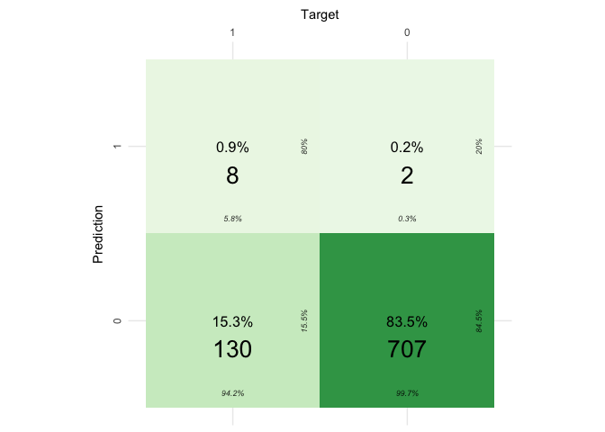<!-- -->
\# Random Forest

Random Forest uses bagging technique that gives higher accuracy compared
to other models and its interpretability is also good. It avoids the
problem of overfitting and reduces the variance.

Fitting the Random Forest Model on the training dataset

``` r
train_data$TenYearCHD<- as.factor(train_data$TenYearCHD)
test_data$TenYearCHD<- as.factor(test_data$TenYearCHD)

rf=randomForest(TenYearCHD~.,data =train_data ,mtry=6,importance=TRUE)
rf
```

    ## 
    ## Call:
    ##  randomForest(formula = TenYearCHD ~ ., data = train_data, mtry = 6,      importance = TRUE) 
    ##                Type of random forest: classification
    ##                      Number of trees: 500
    ## No. of variables tried at each split: 6
    ## 
    ##         OOB estimate of  error rate: 15.4%
    ## Confusion matrix:
    ##      0  1 class.error
    ## 0 2839 45  0.01560333
    ## 1  477 28  0.94455446

Plotting the confusion matrix

``` r
yhat = predict(rf,newdata=test_data)
cf_mat_rf=confusionMatrix(yhat,test_data$TenYearCHD)
cf_mat_rf
```

    ## Confusion Matrix and Statistics
    ## 
    ##           Reference
    ## Prediction   0   1
    ##          0 701 125
    ##          1   8  13
    ##                                           
    ##                Accuracy : 0.843           
    ##                  95% CI : (0.8167, 0.8668)
    ##     No Information Rate : 0.8371          
    ##     P-Value [Acc > NIR] : 0.3409          
    ##                                           
    ##                   Kappa : 0.1259          
    ##                                           
    ##  Mcnemar's Test P-Value : <2e-16          
    ##                                           
    ##             Sensitivity : 0.9887          
    ##             Specificity : 0.0942          
    ##          Pos Pred Value : 0.8487          
    ##          Neg Pred Value : 0.6190          
    ##              Prevalence : 0.8371          
    ##          Detection Rate : 0.8276          
    ##    Detection Prevalence : 0.9752          
    ##       Balanced Accuracy : 0.5415          
    ##                                           
    ##        'Positive' Class : 0               
    ## 

Fetching All the metrics of Random Forest model

``` r
cf_mat_rf$byClass
```

    ##          Sensitivity          Specificity       Pos Pred Value 
    ##            0.9887165            0.0942029            0.8486683 
    ##       Neg Pred Value            Precision               Recall 
    ##            0.6190476            0.8486683            0.9887165 
    ##                   F1           Prevalence       Detection Rate 
    ##            0.9133550            0.8370720            0.8276269 
    ## Detection Prevalence    Balanced Accuracy 
    ##            0.9752066            0.5414597

Plotting the Confusion Matrix using cvms library

``` r
conf_mat_rf <- confusion_matrix(targets = test_data$TenYearCHD,
                                predictions = yhat) 


plot_confusion_matrix(conf_mat_rf$`Confusion Matrix`[[1]],
                      font_counts = font(
                        size = 7,
                        color = "black"
                      ),palette = "Greens")
```

    ## Warning in plot_confusion_matrix(conf_mat_rf$`Confusion Matrix`[[1]],
    ## font_counts = font(size = 7, : 'ggimage' is missing. Will not plot arrows and
    ## zero-shading.

    ## Warning in plot_confusion_matrix(conf_mat_rf$`Confusion Matrix`[[1]],
    ## font_counts = font(size = 7, : 'rsvg' is missing. Will not plot arrows and zero-
    ## shading.

<!-- -->

Even though the accuracy of all these models is considerably good,
Confusion matrix, Precision, recall values state that the models are
generalizing the positive class to negative class. This is because the
class labels are imbalanced. To overcome this problem, we need to
perform oversampling. Here, we are using Synthetic Minority Oversampling
Technique (SMOTE). Initially the data has 3,593 negative records and 643
positive records. After using SMOTE the data is balanced to 3,593
negative records and 3581 positive records.

# MODELING – AFTER SMOTE

Oversampling the data using SMOTE and balancing the output variable

``` r
smote= ovun.sample(TenYearCHD~.,data=heart_data,method="over")$data
table(heart_data$TenYearCHD)
```

    ## 
    ##    0    1 
    ## 3593  643

``` r
table(smote$TenYearCHD)
```

    ## 
    ##    0    1 
    ## 3593 3570

Subsetting the SMOTE dataset into two dataframe with train data of 80%
and test data of 20% and setting a seed of 100.

``` r
set.seed(100)
train.index_smote <- createDataPartition(smote$TenYearCHD, p = .8, list = FALSE)
train_data_smote <- smote[ train.index_smote,]
test_data_smote  <- smote[-train.index_smote,]
```

# Logistic Regression after re-sampling

Fitting Logistic Regression Model after Re-sampling the dataset.

``` r
glm.fit.smote <- glm(TenYearCHD~., 
                     data=train_data_smote,
                     family=binomial)
summary(glm.fit.smote)
```

    ## 
    ## Call:
    ## glm(formula = TenYearCHD ~ ., family = binomial, data = train_data_smote)
    ## 
    ## Deviance Residuals: 
    ##     Min       1Q   Median       3Q      Max  
    ## -2.6738  -1.0083  -0.4786   1.0164   2.1413  
    ## 
    ## Coefficients:
    ##                   Estimate Std. Error z value Pr(>|z|)    
    ## (Intercept)     -6.5250034  0.4169574 -15.649  < 2e-16 ***
    ## male             0.4763090  0.0630114   7.559 4.06e-14 ***
    ## age              0.0666995  0.0040165  16.606  < 2e-16 ***
    ## currentSmoker    0.0753859  0.0921128   0.818  0.41312    
    ## cigsPerDay       0.0236782  0.0038125   6.211 5.27e-10 ***
    ## BPMeds           0.2570696  0.1604161   1.603  0.10904    
    ## prevalentStroke  0.5055360  0.3582975   1.411  0.15826    
    ## prevalentHyp     0.3437308  0.0844710   4.069 4.72e-05 ***
    ## diabetes         0.1756273  0.2178764   0.806  0.42019    
    ## totChol          0.0019148  0.0006661   2.875  0.00405 ** 
    ## sysBP            0.0100294  0.0024033   4.173 3.00e-05 ***
    ## diaBP           -0.0009209  0.0039840  -0.231  0.81720    
    ## BMI              0.0075299  0.0073803   1.020  0.30760    
    ## heartRate       -0.0016691  0.0025194  -0.662  0.50766    
    ## glucose          0.0073275  0.0016404   4.467 7.94e-06 ***
    ## ---
    ## Signif. codes:  0 '***' 0.001 '**' 0.01 '*' 0.05 '.' 0.1 ' ' 1
    ## 
    ## (Dispersion parameter for binomial family taken to be 1)
    ## 
    ##     Null deviance: 7944.5  on 5730  degrees of freedom
    ## Residual deviance: 6934.0  on 5716  degrees of freedom
    ## AIC: 6964
    ## 
    ## Number of Fisher Scoring iterations: 4

Predicting Logistic Regression Model after re-sampling the data.

``` r
test.predicted.model.smote <- predict(glm.fit.smote, test_data_smote, type = "response")
glm.pred.smote=rep(0,nrow(test_data_smote))
glm.pred.smote[test.predicted.model.smote>.5]=1
glm.pred.smote<- as.factor(glm.pred.smote)
```

Plotting the confusion matrix

``` r
cf_LR_Smote<-confusionMatrix(as.factor(test_data_smote$TenYearCHD), glm.pred.smote,positive="1")
cf_LR_Smote
```

    ## Confusion Matrix and Statistics
    ## 
    ##           Reference
    ## Prediction   0   1
    ##          0 478 226
    ##          1 224 504
    ##                                          
    ##                Accuracy : 0.6858         
    ##                  95% CI : (0.661, 0.7097)
    ##     No Information Rate : 0.5098         
    ##     P-Value [Acc > NIR] : <2e-16         
    ##                                          
    ##                   Kappa : 0.3713         
    ##                                          
    ##  Mcnemar's Test P-Value : 0.9624         
    ##                                          
    ##             Sensitivity : 0.6904         
    ##             Specificity : 0.6809         
    ##          Pos Pred Value : 0.6923         
    ##          Neg Pred Value : 0.6790         
    ##              Prevalence : 0.5098         
    ##          Detection Rate : 0.3520         
    ##    Detection Prevalence : 0.5084         
    ##       Balanced Accuracy : 0.6857         
    ##                                          
    ##        'Positive' Class : 1              
    ## 

Fetching all the metrics of Logistic Regression Model after resampling

``` r
cf_LR_Smote$byClass
```

    ##          Sensitivity          Specificity       Pos Pred Value 
    ##            0.6904110            0.6809117            0.6923077 
    ##       Neg Pred Value            Precision               Recall 
    ##            0.6789773            0.6923077            0.6904110 
    ##                   F1           Prevalence       Detection Rate 
    ##            0.6913580            0.5097765            0.3519553 
    ## Detection Prevalence    Balanced Accuracy 
    ##            0.5083799            0.6856613

Plotting the confusion matrix using cvms library

``` r
conf_mat_lr_smote <- confusion_matrix(targets =as.factor(test_data_smote$TenYearCHD),
                                      predictions = as.factor(glm.pred.smote) )

plot_confusion_matrix(conf_mat_lr_smote$`Confusion Matrix`[[1]],
                      font_counts = font(
                        size = 7,
                        color = "black"
                      ),palette = "Greens")
```

    ## Warning in plot_confusion_matrix(conf_mat_lr_smote$`Confusion Matrix`[[1]], :
    ## 'ggimage' is missing. Will not plot arrows and zero-shading.

    ## Warning in plot_confusion_matrix(conf_mat_lr_smote$`Confusion Matrix`[[1]], :
    ## 'rsvg' is missing. Will not plot arrows and zero-shading.

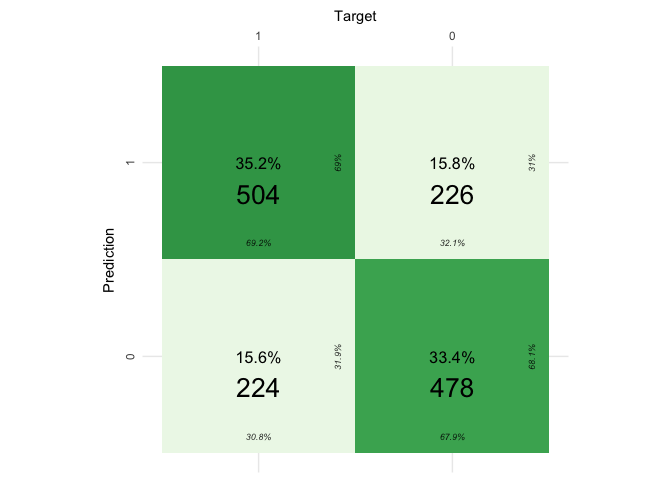<!-- -->

# K-Nearest Neighbors after Re-sampling

Converting the dataframe into matrix by eliminating the output variable
to run KNN Algorithm

``` r
trainx_smote <- as.matrix(train_data_smote[,-15])
valx_smote <- as.matrix(test_data_smote[,-15])
```

Finding the best K-Value to fit the model using that k-value

``` r
error_smote<-rep(NA,200)
for(i in 1:200)
{
  knn.pred=knn(trainx_smote,valx_smote,train_data_smote$TenYearCHD,k=i)
  error_smote[i]=mean(knn.pred!=test_data_smote$TenYearCHD)
}

plot(error_smote,type="l",xlab="K",ylab="Test Error",main = "K Value vs Test Error for KNN (Smote)")
```

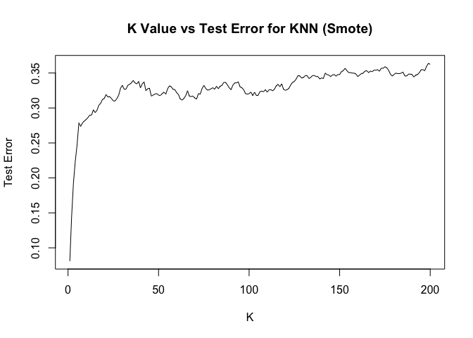<!-- -->

``` r
loc=which.min(error_smote)
loc
```

    ## [1] 1

As we got the best K-value of 1 we will be fitting the model based on it
using a seed of 100

``` r
set.seed(100)
knn.pred_smote <- knn(trainx_smote, valx_smote, train_data_smote$TenYearCHD, k=1, prob=TRUE)
summary(knn.pred_smote)
```

    ##   0   1 
    ## 592 840

Plotting the confusion matrix of KNN Model after re-sampling

``` r
cf_knn_smote <- confusionMatrix(data =  as.factor(knn.pred_smote), reference = as.factor(test_data_smote$TenYearCHD), positive="1")
cf_knn_smote
```

    ## Confusion Matrix and Statistics
    ## 
    ##           Reference
    ## Prediction   0   1
    ##          0 590   2
    ##          1 114 726
    ##                                           
    ##                Accuracy : 0.919           
    ##                  95% CI : (0.9036, 0.9326)
    ##     No Information Rate : 0.5084          
    ##     P-Value [Acc > NIR] : < 2.2e-16       
    ##                                           
    ##                   Kappa : 0.8375          
    ##                                           
    ##  Mcnemar's Test P-Value : < 2.2e-16       
    ##                                           
    ##             Sensitivity : 0.9973          
    ##             Specificity : 0.8381          
    ##          Pos Pred Value : 0.8643          
    ##          Neg Pred Value : 0.9966          
    ##              Prevalence : 0.5084          
    ##          Detection Rate : 0.5070          
    ##    Detection Prevalence : 0.5866          
    ##       Balanced Accuracy : 0.9177          
    ##                                           
    ##        'Positive' Class : 1               
    ## 

Fetching all the metrics of the model

``` r
cf_knn_smote$byClass
```

    ##          Sensitivity          Specificity       Pos Pred Value 
    ##            0.9972527            0.8380682            0.8642857 
    ##       Neg Pred Value            Precision               Recall 
    ##            0.9966216            0.8642857            0.9972527 
    ##                   F1           Prevalence       Detection Rate 
    ##            0.9260204            0.5083799            0.5069832 
    ## Detection Prevalence    Balanced Accuracy 
    ##            0.5865922            0.9176605

Plotting the confusion matrix using cvms library

``` r
conf_mat_knn_smote <- confusion_matrix(targets = test_data_smote$TenYearCHD,
                                       predictions = as.factor(knn.pred_smote)) 


plot_confusion_matrix(conf_mat_knn_smote$`Confusion Matrix`[[1]],
                      font_counts = font(
                        size = 7,
                        color = "black"
                      ),palette = "Greens")
```

    ## Warning in plot_confusion_matrix(conf_mat_knn_smote$`Confusion Matrix`[[1]], :
    ## 'ggimage' is missing. Will not plot arrows and zero-shading.

    ## Warning in plot_confusion_matrix(conf_mat_knn_smote$`Confusion Matrix`[[1]], :
    ## 'rsvg' is missing. Will not plot arrows and zero-shading.

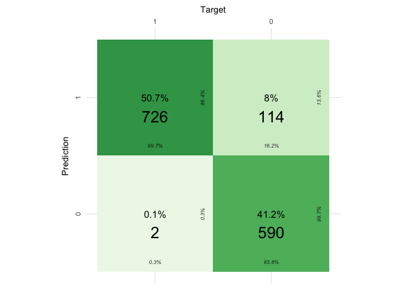<!-- -->

# Random Forest after resampling

Fitting Random Forest model

``` r
train_data_smote$TenYearCHD<- as.factor(train_data_smote$TenYearCHD)
test_data_smote$TenYearCHD<- as.factor(test_data_smote$TenYearCHD)
rf_smote=randomForest(TenYearCHD~.,data =train_data_smote ,mtry=6,importance=TRUE)
rf_smote
```

    ## 
    ## Call:
    ##  randomForest(formula = TenYearCHD ~ ., data = train_data_smote,      mtry = 6, importance = TRUE) 
    ##                Type of random forest: classification
    ##                      Number of trees: 500
    ## No. of variables tried at each split: 6
    ## 
    ##         OOB estimate of  error rate: 3.33%
    ## Confusion matrix:
    ##      0    1 class.error
    ## 0 2726  163 0.056420907
    ## 1   28 2814 0.009852217

Plotting the confusion matrix of Random Forest Model

``` r
yhatsmote = predict(rf_smote,newdata=test_data_smote)
rf_conf_smote=confusionMatrix(yhatsmote,test_data_smote$TenYearCHD)
rf_conf_smote
```

    ## Confusion Matrix and Statistics
    ## 
    ##           Reference
    ## Prediction   0   1
    ##          0 670   5
    ##          1  34 723
    ##                                          
    ##                Accuracy : 0.9728         
    ##                  95% CI : (0.963, 0.9806)
    ##     No Information Rate : 0.5084         
    ##     P-Value [Acc > NIR] : < 2.2e-16      
    ##                                          
    ##                   Kappa : 0.9455         
    ##                                          
    ##  Mcnemar's Test P-Value : 7.34e-06       
    ##                                          
    ##             Sensitivity : 0.9517         
    ##             Specificity : 0.9931         
    ##          Pos Pred Value : 0.9926         
    ##          Neg Pred Value : 0.9551         
    ##              Prevalence : 0.4916         
    ##          Detection Rate : 0.4679         
    ##    Detection Prevalence : 0.4714         
    ##       Balanced Accuracy : 0.9724         
    ##                                          
    ##        'Positive' Class : 0              
    ## 

Fetching the metrics of the model

``` r
rf_conf_smote$byClass
```

    ##          Sensitivity          Specificity       Pos Pred Value 
    ##            0.9517045            0.9931319            0.9925926 
    ##       Neg Pred Value            Precision               Recall 
    ##            0.9550859            0.9925926            0.9517045 
    ##                   F1           Prevalence       Detection Rate 
    ##            0.9717186            0.4916201            0.4678771 
    ## Detection Prevalence    Balanced Accuracy 
    ##            0.4713687            0.9724182

Plotting the confusion matrix using cvms

``` r
conf_mat_rf_smote <- confusion_matrix(targets = test_data_smote$TenYearCHD,
                                      predictions = yhatsmote) 

plot_confusion_matrix(conf_mat_rf_smote$`Confusion Matrix`[[1]],
                      font_counts = font(
                        size = 7,
                        color = "black"
                      ),palette = "Greens")
```

    ## Warning in plot_confusion_matrix(conf_mat_rf_smote$`Confusion Matrix`[[1]], :
    ## 'ggimage' is missing. Will not plot arrows and zero-shading.

    ## Warning in plot_confusion_matrix(conf_mat_rf_smote$`Confusion Matrix`[[1]], :
    ## 'rsvg' is missing. Will not plot arrows and zero-shading.

<!-- -->
Fetching the importantance of each feature of random forest

``` r
importance(rf_smote)
```

    ##                          0         1 MeanDecreaseAccuracy MeanDecreaseGini
    ## male             4.1960474  54.15565             54.51272        62.885655
    ## age             32.2927889 224.03271            211.22773       448.412527
    ## currentSmoker   -4.5110158  27.98688             28.10661        29.515904
    ## cigsPerDay       2.7953400  85.42204             81.73284       154.323274
    ## BPMeds           5.6957243  24.15567             24.18446        12.373429
    ## prevalentStroke  0.1271853  10.76634             10.54639         3.056338
    ## prevalentHyp     7.3011651  33.07862             33.08069        66.278935
    ## diabetes         7.5041696  16.63607             17.68054        12.188323
    ## totChol         11.6272899 130.81373            127.50075       358.388370
    ## sysBP           21.2636647 102.63846            105.33646       391.365623
    ## diaBP           15.2905783  88.00384             89.21860       313.669491
    ## BMI              3.1605346 128.17824            126.20753       382.911150
    ## heartRate        9.7722207 119.95984            114.02509       290.759927
    ## glucose          8.7346617 140.62407            133.68335       338.058246

Plotting the top 5 important features of the model

``` r
varImpPlot(rf_smote,main = "Top 5 Important Features derived from Random Forest (Smote)",frame.plot = TRUE,
           lcolor="Red",bg = "black",n.var =5)
```

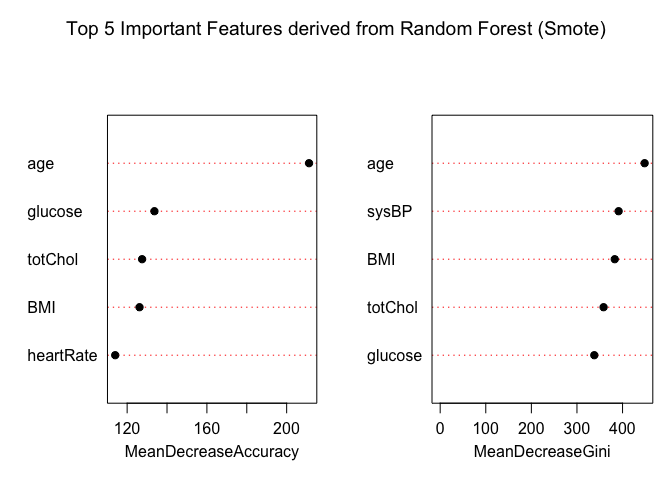<!-- -->

Plotting the Accuracy of all the models

``` r
Accuracy <- c(confusion_LR$overall['Accuracy'], cf_LR_Smote$overall['Accuracy'], 
              cf_mat_knn$overall['Accuracy'], cf_knn_smote$overall['Accuracy'],
              cf_mat_rf$overall['Accuracy'],rf_conf_smote$overall['Accuracy']
)
li<-list(Accuracy)
Model <- c("Logistic Regression","Logistic Regression (Smote)","KNN","KNN (Smote)","Random Forest","Random Forest (Smote)")
df <- data.frame(li,Model)
names(df)[1]<-"Accuracy"

ggplot(df,aes(x=Model,y=Accuracy,group=1))+
  geom_line()+
  geom_point(colour = "red", size = 3)+
  ggtitle("Accuracy Comparison of all Models")+
  theme(plot.title = element_text(hjust = 0.5,size = 25,face="bold"),axis.title = element_text(,size = 20),
        axis.text =element_text(size=13) )
```

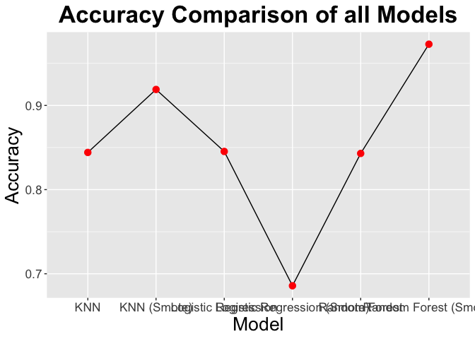<!-- -->

# Comparing and contrasting above results:

For Logistic Regression, when compared to the previous model and the
current model using SMOTE. Although the accuracy is low, Precision,
Recall values are considerably higher which indicates that
interpretability of the model is increased. Since, our aim is to reduce
the Type 1 (False Positives) and Type 2 errors (False Negatives), we are
exploring other models to check their performance.

KNN produced very good results by reducing False Negatives to a greater
extent and also reducing the False Positives. On the other hand, Random
forest further reduced the False Negatives by keeping the False
Positives at a lower rate.

Finally, it can be observed that Random Forest performed very well and
it is the best model. Below is the accuracy comparison of all the
models.

# Limitations and Future Analysis Needed

The dataset available is an imbalanced data so there was an issue of
introducing bias to the training model. Therefore, the testing data is
more generalized towards the higher-class label. If the data is balanced
then we could have more information about the people of positive class.
The amount of data is not large enough and it would have been more
beneficial if wide range of data would be available.

Future Research would be including the data for other regions as well.
It will be beneficial to know the trends and patterns of the Heart
Disease in various regions. Food Habits and workout pattern also play a
crucial role in predicting the Coronary Heart Disease (CHD), introducing
these variables would give more information on understanding the
external factors influencing the heart disease.

# Conclusion

In conclusion, this research attempted to produce few insights on the
top five important reasons for the cause of Coronary Heart Disease. It
determines that Random forest with SMOTE is the best model to derive the
important features with the best accuracy among all. Based on the
findings, precautions might be taken against those who are anticipated
to have a high risk of developing coronary heart disease.
